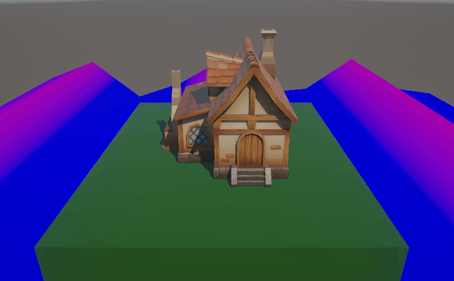
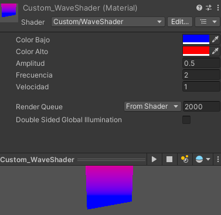

# Pipeline gráfico moderno: Shaders y renderizado programable

## Tema seleccionado

Vertex Shader: Transformaciones geométricas y deformación dinámica de mallas

## Nombre del estudiante(s)

- Baruj Vladimir Ramírez Escalante
- Joan Sebastian Roberto Puerto
- Maicol Sebastian Olarte Ramirez

## Fecha de entrega

2026-02-23

---

## Descripción del tema

El pipeline gráfico moderno ha evolucionado de un sistema de funciones fijas a un modelo completamente programable, donde los shaders permiten controlar cada etapa del proceso de renderizado. Este trabajo se enfoca en el **Vertex Shader**, una de las etapas programables fundamentales que procesa individualmente cada vértice de una malla 3D.

El Vertex Shader es responsable de transformar la geometría desde el espacio local del modelo hasta el espacio de clip, pasando por los espacios mundial (world) y de vista (view). Además, calcula normales para iluminación, genera atributos interpolables (varyings) para etapas posteriores y puede realizar optimizaciones como deformaciones geométricas o animaciones por vértice.

La importancia del Vertex Shader radica en que es la primera etapa programable del pipeline y determina la posición final de todos los puntos que serán rasterizados, lo que lo hace ideal para efectos como deformaciones ondulatorias, animaciones esqueléticas (skinning) y desplazamientos geométricos.

---

## Explicación matemática resumida

El Vertex Shader se basa fundamentalmente en transformaciones lineales representadas mediante matrices. Las operaciones matemáticas clave son:

### 1. Transformación de coordenadas

Un vértice en su espacio local (v_local) pasa por múltiples transformaciones hasta llegar al espacio de clip:
*v_clip = M_proyección · M_vista · M_modelo · v_local*

Donde:

- **M_modelo**: Transforma del espacio local al espacio mundial (world)
- **M_vista**: Transforma del espacio mundial al espacio de la cámara (view)
- **M_proyección**: Transforma al espacio de clip (proyección perspectiva u ortográfica)

### 2. Transformación de normales

Las normales requieren un tratamiento especial para mantener la perpendicularidad a la superficie después de transformaciones no uniformes:
*n_world = (M_modelo⁻¹)ᵀ · n_local*

En la práctica, esto se implementa como `transpose(inverse(modelMatrix))`.

### 3. Deformación ondulatoria (ejemplo práctico)

Para el shader de onda presentado, la posición vertical se modifica mediante:
*y' = y + A · sin(ω · x + φ · t)*

Donde:

- **A**: Amplitud de la onda
- **ω**: Frecuencia espacial
- **φ**: Velocidad de fase (dependiente del tiempo)
- **t**: Tiempo (uniforme pasado al shader)

---

## Descripción de la implementación

### Implementación práctica: "Wave Shader" en Unity

Se desarrolló un shader en Unity que deforma un plano de manera dinámica simulando ondas, demostrando el uso del Vertex Shader para modificar geometría y del Fragment Shader para determinar color en función de la altura.

**Características del shader:**

1. **Vertex Shader:**
   - Recibe posición, normal y UV del vértice
   - Aplica transformación de modelo-vista-proyección estándar
   - Modifica la altura (coordenada y) basada en una función senoidal que depende de la posición x y el tiempo
   - Pasa la altura modificada al Fragment Shader a través de un varying
   - Transfiere coordenadas UV para texturizado

2. **Fragment Shader:**
   - Recibe la altura interpolada desde el Vertex Shader
   - Calcula color basado en la altura (gradiente de azul a verde a rojo)
   - Aplica iluminación básica considerando la normal del plano

3. **Uniforms utilizados:**
   - `_WaveAmplitude`: Controla la altura máxima de las ondas
   - `_WaveFrequency`: Controla la frecuencia espacial (qué tan juntas están las ondas)
   - `_WaveSpeed`: Controla la velocidad de movimiento de las ondas
   - `_Time`: Variable de tiempo incorporada de Unity

4. **Buffers y configuración:**
   - VBO (Vertex Buffer Object): Contiene posición (xyz), normal (xyz) y UV (uv)
   - IBO (Index Buffer Object): Define los triángulos del plano
   - Uniforms actualizados por frame desde script C# para animación continua

**Interacción en Unity:**

- Se creó un material que utiliza este shader
- Se asignó a un plano subdividido (mayor resolución para ondas más suaves)
- Un script C# actualiza los uniforms de amplitud, frecuencia y velocidad en tiempo real
- Se incluyó un slider en la UI para control interactivo de los parámetros

---

## Resultados visuales (mínimo 2 evidencias)

### Visualización 1: Gradiente de color basado en altura



Vista general del plano deformado por el Vertex Shader, mostrando el movimiento ondulatorio propagándose a través de la superficie. Se aprecia cómo la geometría se modifica dinámicamente en la GPU, con las crestas y valles de las ondas desplazándose según el tiempo.

Adicionalmente se muestra la interpolación de color en el Fragment Shader: las zonas altas (crestas) se renderizan en rojo, las zonas medias en verde y las zonas bajas (valles) en azul. Este efecto se logra pasando la altura como varying desde el Vertex Shader y utilizándola para calcular el color final.

### Visualización 2: Control de parámetros


Demostración de los campos en la interfaz de Unity que permiten modificar en tiempo real la amplitud, frecuencia y velocidad de las ondas, mostrando la flexibilidad del uso de uniforms para control dinámico del shader.

### Visualización 3: material



Material creado a partir del shader, el cual es el que finalmente se le aplica a un objeto para alterar su mesh.

---

## Código relevante

### Script de shader C# para generación de ondas

Declaración de Varyings y uso del vertex shader para modificación de la malla segun función seno.

```hlsl
...
            struct Varyings
            {
                float4 positionHCS : SV_POSITION;
                float height : TEXCOORD0;
            };

            Varyings vert(Attributes IN)
            {
                Varyings OUT;

                float wave = sin(IN.positionOS.x * _Frequency + _Time.y * _Speed) * _Amplitude;

                float3 newPos = IN.positionOS.xyz;
                newPos.y += wave;

                OUT.height = newPos.y;
                OUT.positionHCS = TransformObjectToHClip(newPos);

                return OUT;
            }
...

```

Uso del fragment shader para el cambio de color según altura de la función seno.

```hlsl
...

            half4 frag(Varyings IN) : SV_Target
            {
                float t = saturate(IN.height);
                return lerp(_ColorA, _ColorB, t);
            }
...

```

---

## Prompts utilizados (si aplicó IA)

- "Crea un shader en Unity que deforme un plano con una función senoidal en el Vertex Shader, donde la altura dependa de la posición x y el tiempo."
- "¿Cómo paso datos desde el Vertex Shader al Fragment Shader en Unity para usar la altura modificada en el cálculo del color?"
- "Explica la transformación correcta de normales en un Vertex Shader cuando se deforma la geometría."
- "¿Cómo implemento sliders en Unity para controlar parámetros de un shader en tiempo real?"
- "¿Qué es std140 y por qué es importante para la alineación de uniform buffers?"

---

## Aprendizajes y dificultades

### Aprendizajes

Este trabajo permitió comprender en profundidad el rol del Vertex Shader dentro del pipeline gráfico moderno y cómo su programabilidad abre infinitas posibilidades creativas y de optimización. Se aprendió que el Vertex Shader no solo transforma posiciones, sino que puede modificar activamente la geometría, generar datos para etapas posteriores y realizar cálculos que alivien la carga del Fragment Shader.

La implementación del shader de ondas demostró la importancia de la comunicación entre etapas mediante varyings: la altura calculada en el Vertex Shader se interpola correctamente para cada fragmento, permitiendo un gradiente de color suave. También se reforzó el concepto de uniforms como parámetros dinámicos que pueden actualizarse desde scripts para crear experiencias interactivas.

Matemáticamente, quedó claro que la transformación de normales requiere la matriz inversa transpuesta para mantener la perpendicularidad cuando hay escalas no uniformes, un detalle crítico que suele pasarse por alto.

### Dificultades

La principal dificultad fue lograr que la deformación ondulatoria se viera suave y continua. Inicialmente, con un plano de baja resolución, las ondas se veían facetadas y poco naturales. La solución fue aumentar la subdivisión del plano (más vértices) para que la función senoidal tuviera suficientes puntos de muestreo.

Otro desafío fue la interpolación correcta de la altura. Al principio se intentó calcular el color completamente en el Vertex Shader y pasar un color fijo, lo que resultaba en un color plano por triángulo. Se comprendió que para obtener un gradiente suave era necesario pasar la altura como varying y dejar que la GPU interpole los valores entre vértices.

En la parte matemática, entender por qué las normales requieren la matriz inversa transpuesta tomó tiempo, pero fue fundamental para garantizar una iluminación correcta cuando se modifica la geometría.

### Mejoras futuras

Para futuras iteraciones, se podría extender el shader para que la onda se propague en dos dimensiones (x y z) creando efectos de oleaje más complejos. También sería interesante implementar el mismo efecto en otros motores como Unreal Engine para comparar la sintaxis de shaders (HLSL vs GLSL vs Material Graphs).

Otra mejora sería agregar detección de normales recalculadas automáticamente para que la iluminación refleje correctamente la superficie deformada, en lugar de usar las normales originales del plano.
